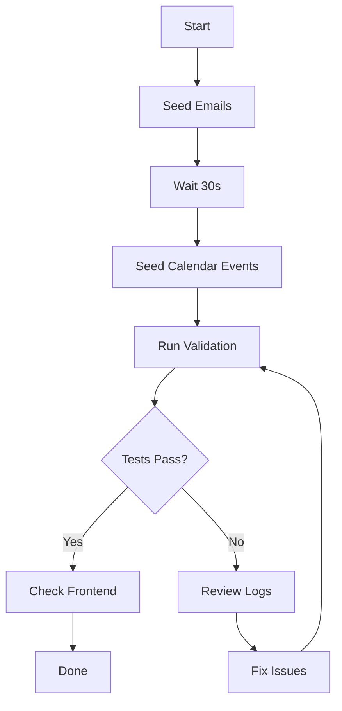

# Orchestration Testing Scripts

This directory contains comprehensive testing scripts for validating the data orchestration layer's email matching, calendar matching, and enrichment quality.

## Quick Start

### Prerequisites
1. Backend and frontend servers running (`.\start-simple.ps1`)
2. HubSpot connected (with at least 10 deals)
3. Google OAuth completed (Gmail + Calendar access)

### Phase 2: Email Matching Testing

**Step 1: Seed Test Emails**
```bash
cd backend
node scripts/seedEmailScenarios.js
```

This creates 10-15 test emails across 5 scenarios:
- **Scenario A**: Exact email match (uses real HubSpot contact emails)
- **Scenario B**: Domain match (same company, different person)
- **Scenario C**: Keyword match (deal name in subject/body)
- **Scenario D**: Renewal keywords only
- **Scenario E**: No match (unrelated emails)

**Step 2: Wait & Validate**
```bash
# Wait 30 seconds for emails to arrive in Gmail
node scripts/testOrchestration.js
```

Expected output:
```
✅ Email match accuracy: 80%+
✅ Sync completed in < 5 seconds
🎉 OVERALL STATUS: PASS
```

### Phase 3: Calendar Matching Testing

**Step 1: Seed Calendar Events**
```bash
node scripts/seedCalendarEvents.js
```

This creates 8 calendar events across 4 scenarios:
- **Scenario A**: Attendee match (HubSpot contact as attendee)
- **Scenario B**: Keyword match (deal name in title)
- **Scenario C**: Renewal keywords only
- **Scenario D**: No match (unrelated events)

**Step 2: Validate**
```bash
node scripts/testOrchestration.js
```

Expected output:
```
✅ Calendar match accuracy: 70%+
```

## Debug Endpoints

### View Orchestration Statistics
```bash
# Browser or curl
http://localhost:4000/api/debug/orchestration
```

Returns:
- Matching statistics (exact matches, domain matches, etc.)
- Email-to-deal mapping
- Meeting-to-deal mapping
- Enrichment quality metrics
- Performance metrics

### View Specific Renewal
```bash
http://localhost:4000/api/debug/renewal/R-12345001
```

Returns full renewal data with debug information.

## Testing Workflow



## Success Criteria

✅ Email match accuracy ≥ 80%
✅ Calendar match accuracy ≥ 70%
✅ All deals have contact information
✅ Communication metrics calculated correctly
✅ Sync completes in < 5 seconds
✅ No crashes with missing data

## Troubleshooting

**Issue**: "Google is not connected"
- **Fix**: Complete OAuth flow in frontend first

**Issue**: "No emails matched"
- **Fix**: Ensure HubSpot deals have contact emails
- Check email scenarios match your deal names

**Issue**: "Sync too slow"
- **Fix**: Reduce email count in seedEmailScenarios.js
- Check network connection

**Issue**: "Calendar events not created"
- **Fix**: Verify Google Calendar API is enabled
- Check OAuth scopes include calendar.readonly

## Manual Verification

After running automated tests:

1. **Frontend Check**
   - Navigate to http://localhost:3000
   - Click "Sync Data"
   - Select a renewal with touchpoints
   - Verify Communication Timeline shows:
     - Correct email count
     - Recent emails with subjects
     - Days since last contact
     - Color coding (red/yellow/green)

2. **AI Brief Check**
   - Generate AI brief for a renewal
   - Verify it mentions:
     - Recent email activity
     - Meeting history
     - Communication-based recommendations

## Files

- `seedEmailScenarios.js` - Creates test emails (Phase 2)
- `seedCalendarEvents.js` - Creates calendar events (Phase 3)
- `testOrchestration.js` - Validates matching results (Phase 2-4)
- `seedGoogleEmails.js` - Legacy email seeding (deprecated)

## Next Steps

After all tests pass:
1. Review ProcessToBeDone.md for remaining phases
2. Test with larger datasets (50+ emails)
3. Verify AI brief integration
4. Document any edge cases found
